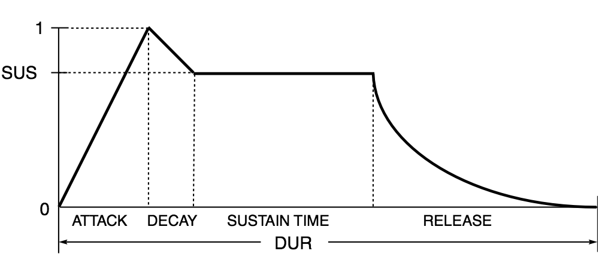

# ADSR Envelope Example

This document demonstrates how to use the ADSR (Attack, Decay, Sustain, Release) envelope feature in Mix.

## What is ADSR?

ADSR is a standard envelope in audio synthesis that controls how volume changes over time:



- **Attack**: Time for the sound to reach full volume from silence
- **Decay**: Time for the sound to drop from peak to sustain level  
- **Sustain**: The level (0 to 1) at which the sound stays during playback
- **Release**: Time for the sound to fade out after playback ends

## Basic Usage

```go
package main

import (
    "time"
    "github.com/go-mix/mix"
    "github.com/go-mix/mix/bind"
)

func main() {
    defer mix.Teardown()
    
    // Configure audio specs
    spec := bind.AudioSpec{
        Freq:     48000,
        Format:   bind.AudioF32,
        Channels: 2,
    }
    mix.Configure(spec)
    mix.SetSoundsPath("sounds/")
    mix.StartAt(time.Now().Add(1 * time.Second))
    
    // Example 1: No envelope (constant volume)
    // attack=0, decay=0, sustainLevel=1.0, release=0
    mix.SetFire("kick.wav", 0, 0, 1.0, 0, 0, 0, 1.0, 0)
    
    // Example 2: Quick attack with smooth release
    // Useful for percussion sounds
    attack := 5 * time.Millisecond
    decay := 0
    sustainLevel := 1.0
    release := 100 * time.Millisecond
    mix.SetFire("snare.wav", 1*time.Second, 0, 1.0, 0, 
                attack, decay, sustainLevel, release)
    
    // Example 3: Soft attack with decay (pad-like sound)
    // Useful for sustained sounds like strings or pads
    attack = 200 * time.Millisecond
    decay = 100 * time.Millisecond
    sustainLevel = 0.7
    release = 300 * time.Millisecond
    mix.SetFire("pad.wav", 2*time.Second, 2*time.Second, 0.8, 0, 
                attack, decay, sustainLevel, release)
    
    // Example 4: Full ADSR envelope
    // Complete control over all phases
    attack = 50 * time.Millisecond
    decay = 50 * time.Millisecond
    sustainLevel = 0.6
    release = 150 * time.Millisecond
    mix.SetFire("synth.wav", 4*time.Second, 1*time.Second, 1.0, 0, 
                attack, decay, sustainLevel, release)
    
    // Wait for playback to complete
    for mix.FireCount() > 0 {
        time.Sleep(100 * time.Millisecond)
    }
}
```

## Common ADSR Patterns

### Percussive Sounds (Drums, Hits)
```go
// Very short attack, no decay/sustain, quick release
attack := 1 * time.Millisecond
decay := 0
sustainLevel := 1.0
release := 50 * time.Millisecond
```

### Pad Sounds (Strings, Ambient)
```go
// Slow attack, gradual decay, moderate sustain, long release
attack := 300 * time.Millisecond
decay := 200 * time.Millisecond
sustainLevel := 0.7
release := 500 * time.Millisecond
```

### Plucked Sounds (Guitar, Piano)
```go
// Quick attack, rapid decay to low sustain, medium release
attack := 10 * time.Millisecond
decay := 100 * time.Millisecond
sustainLevel := 0.4
release := 200 * time.Millisecond
```

### Synth Lead
```go
// Medium attack, short decay, high sustain, quick release
attack := 30 * time.Millisecond
decay := 50 * time.Millisecond
sustainLevel := 0.85
release := 100 * time.Millisecond
```

## Technical Details

- All ADSR times are converted internally to sample counts based on the configured sample rate
- Envelope calculations use linear interpolation between phases
- The envelope multiplier is applied to the base volume parameter
- When release is 0, the sound ends immediately when playback completes
- When release > 0, the sound continues playing during the release phase even after the scheduled end time
- Setting all ADSR parameters to 0 (except sustainLevel=1.0) disables the envelope effect entirely

## Notes

- The sustain parameter in `SetFire` refers to the **duration** of playback, not the sustain level
- The sustainLevel parameter in the ADSR refers to the **volume level** during the sustain phase
- These are two different concepts that happen to share similar naming
